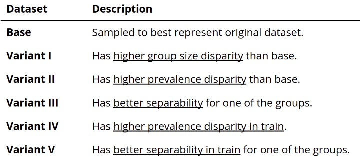

# Project
IntelliFraud: Bank Account Fraud Detection

## Goal
IntelliFraud represents an advanced online tool to revolutionize the identification of fraudulent applications for bank account openings. The tool incorporates an intuitive interactive dashboard that facilitates users in visually exploring extensive statistical data derived from all submitted applications.

What distinguishes IntelliFraud is its distinctive methodology for scrutinizing fraud transactions through interactive graph network analysis , uses Voting & Stacking Classifer modelling technique to detect fraud and analyzes key features impacting the fraud vs non fraud decision using SHAP & ELI5. 

Tool is divided into 4 sections:

1. EDA - User can choose the dataset (Currently 6 Variants of Account Opening Fraud, customizable to any datasets) and perform exploratory data analysis.

2. Fraud Network Analysis - User can choose the dataset and analyze the transaction thru Graph Network Analysis by removing or adding nodes/features to understand the flow of fraudulent transactions thru the network.

3. Modelling - User can choose the data, Fraud vs Non Fraud Sampling Method and Model to observe and analyze various classification metrices and choose the apt model.

4. Inference - Interactive User Interface for users to analyze the account opening fraud by adding data to the features and choosing the model. Interface also enables user to understand the factors leading to the model decision.

## Data 
For our project, we referenced the Kaggle competition  Bank Account Fraud Dataset Suite (NeurIPS 2022)  [ https://www.kaggle.com/datasets/sgpjesus/bank-account-fraud-dataset-neurips-2022 ] that provided 6 datasets which are highly imbalaced.

## Artifacts
Our application is desgined using Streamlit Pages concept.
1. Upon launching `IntelliFraud_Home.py`, it launches the home screen and on left we have 4 different pages to select from. 

2. All pages are loaded from `/pages` directory.
    * 1_EDA.py - Performs EDA on data and provides users interactivity.
    * 2_Fraud_Network_Analysis.py - Vizualiton of Graph network showing the fraudulent transaction flow thru various networks and subsystems.
    * 3_Modelling.py - Explores LightGBM, XGBoost and AdaBoost, Voting and Stacking Classifier models and performances.
    * 4_Inference.py - Creates inference upon user input and explains the reasoning for detecting fraud or not.

3. We have 4 notebooks in `/notebooks` directory (Not Required to launch the application.) These have been created a step by step process to build our application.
    * exploratory_data_analysis.ipynb - Notebook for basic EDA and Exploration for modelling.
    * network_visualization.ipynb - Vizualiton of Graph network showing the fraudulent transaction flow thru various networks and subsystems.
    * intellifraud-data-modelling-all-var.ipynb - Building the models.
    * inference_sample.ipynb - Sample of inferences obtained from selected model and parameters.

## Installation
1. Clone the repository from github.
2. Create a virtual environment called intellifraud -  [ https://code.visualstudio.com/docs/python/environments ]
3. Install all required packages from requirements.txt - [`pip install -r requirements.txt`]
4. Create a folder called "data" at the same directory level as app.py. Open terminal and type `mkdir data`
5. Copy the following datasets from Kaggle:
    /kaggle/input/bank-account-fraud-dataset-neurips-2022/Base.csv
    /kaggle/input/bank-account-fraud-dataset-neurips-2022/Variant I.csv
    /kaggle/input/bank-account-fraud-dataset-neurips-2022/Variant II.csv
    /kaggle/input/bank-account-fraud-dataset-neurips-2022/Variant III.csv
    /kaggle/input/bank-account-fraud-dataset-neurips-2022/Variant IV.csv
    /kaggle/input/bank-account-fraud-dataset-neurips-2022/Variant V.csv

## Execution
1. Without docker - `streamlit run app.py` . Application will open at localhost:8501 automatically.
2. With docker, run the following commands to create the image/container and run from docker
    * `docker build --no-cache -t intellifraud` .
    * `docker run -p 8082:8501 intellifraud`
    * On the browser type `localhost:8082`

